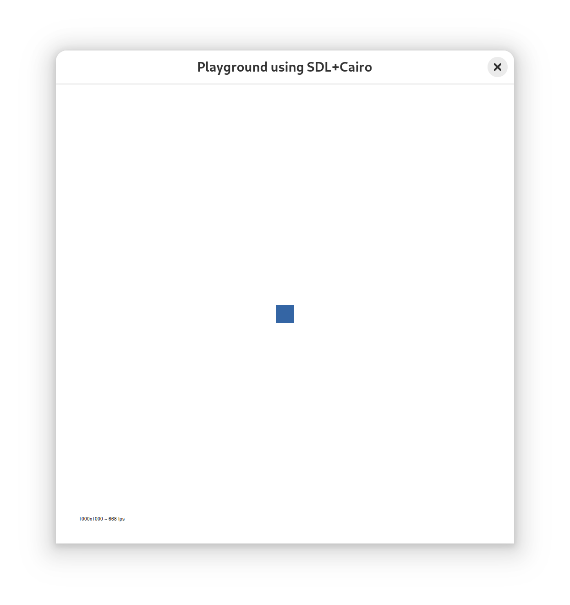

OCaml Elm Playground
=======================

Create pictures, animations, and video games with OCaml!

This is a port of the excellent Elm playground package
https://github.com/evancz/elm-playground to OCaml.

> This is the package I wanted when I was learning programming. Start by
> putting shapes on screen and work up to making games. I hope this
> package will be fun for a broad range of ages and backgrounds!
> *- Evan Czaplicki*


Documentation
---------------------------------------------------

* [Getting started](https://github.com/aryx/ocaml-elm-playground?tab=readme-ov-file#ocaml-elm-playground) (this file)
* [Basic examples](https://aryx.github.io/ocaml-elm-playground/examples/)
* [Basic games](https://aryx.github.io/ocaml-elm-playground/games/)
* [API reference](https://aryx.github.io/ocaml-elm-playground/)

Features
--------------

The OCaml `elm_playground` package allows you to easily create
pictures, animations, and even video games using an API that really
simplifies how to view the computer and its devices (the screen,
keyboard, and mouse).

The goal is similar to the old `graphics.mli` (now available in a separate repo at
https://github.com/ocaml/graphics).

The main API is defined in a single
[Playground.mli](https://github.com/aryx/ocaml-elm-playground/blob/master/playground/Playground.mli) and is implemented by two backends:
 - a native (SDL-based) backend to run your game in a terminal
 - a web (vdom-based) backend to run your game in a browser

Here is for example a simple [Snake game](https://aryx.github.io/ocaml-elm-playground/games/Snake.html) you can run from your browser (use the arrow keys to change the direction of the snake and eat the ball to grow your length). You can run the same game
in a terminal without changing a line of code.

Install
--------------

To install the playground, run `opam install elm_playground` and then
install one or both backends with `opam install elm_playground_native`
and/or `opam install elm_playground_web`.

Simple native application
--------------------------

Here is a a very application using the playground:
```ocaml
open Playground

(* the (x, y) position of the blue square  *)
type model = (int * int)

let initial_state : model = (0., 0.)

let view _computer (x, y) = [ 
  square blue 40.
   |> move x y
 ]

let update computer (x, y) =
  (x +. to_x computer.keyboard, y +. to_y computer.keyboard)

let app = 
  game view update initial_state

let main = Playground_platform.run_app app
```
<!-- coupling: docs/toy-native-example/toy.ml and examples/Keyboard.ml -->

It is a very simple `game` defining a `view` and `update` function
to specify how the game behaves.

To compile this application, simply do:
```bash
$ cd docs/toy-native-example
$ opam install --deps-only --yes .
$ dune exec --root . ./Toy.exe
```
You should then see in your terminal:



If you type on the arrow keys on your keyboard the blue square should move in the
corresponding direction. If you type `q` it will exit the game.

Simple web application
--------------------------

To compile this same application for the web, simply do:

```bash
$ cd docs/toy-web-example
$ opam install --deps-only --yes .
$ dune build --root .
$ cp _build/default/Toy.bc.js static/
```
You should be able to then use the app by going to:
https://aryx.github.io/ocaml-elm-playground/toy-web-example/static/Toy.html

By default the generated javascript file can be big so to get a smaller one
you can do instead:
```bash
$ dune build --root . --profile=release
$ cp _build/default/Toy.bc.js static/
```
