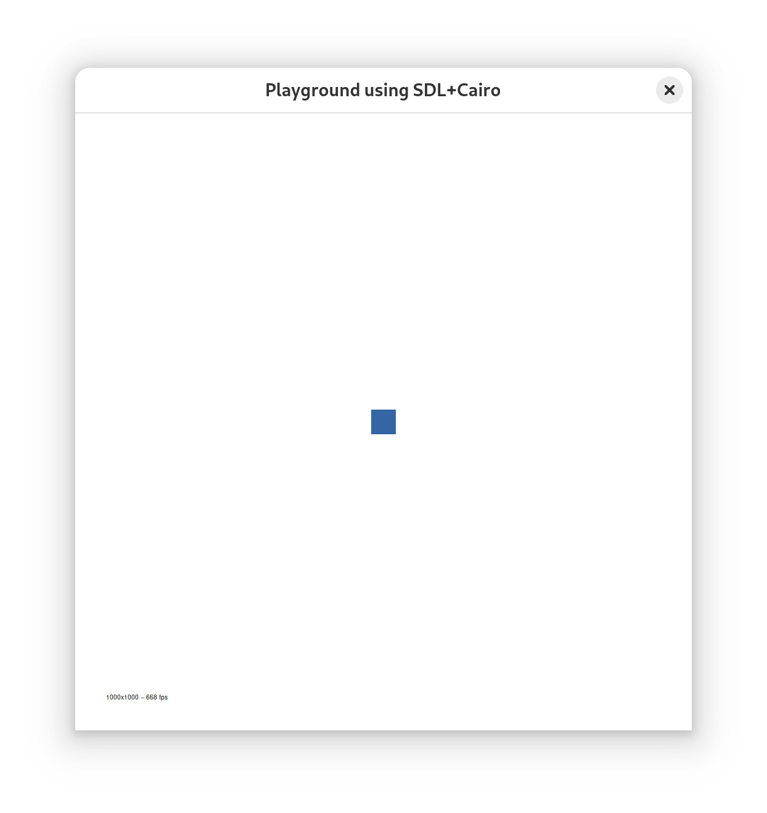
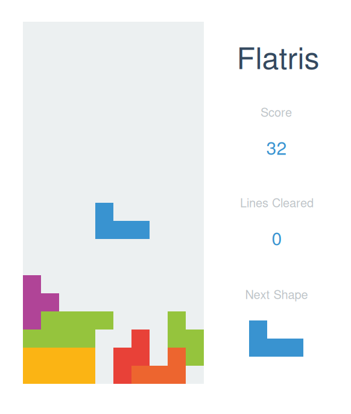

OCaml Elm Playground
=======================

Create pictures, animations, and video games with OCaml!

This is a port of the excellent Elm playground package
https://github.com/evancz/elm-playground to OCaml.

> This is the package I wanted when I was learning programming. Start by
> putting shapes on screen and work up to making games. I hope this
> package will be fun for a broad range of ages and backgrounds!
> *- Evan Czaplicki*


Documentation
---------------------------------------------------

* [Getting started](https://github.com/aryx/ocaml-elm-playground?tab=readme-ov-file#ocaml-elm-playground) (this file)
* [Tutorial](https://aryx.github.io/ocaml-elm-playground/elm_playground/)
* [Basic examples](https://aryx.github.io/ocaml-elm-playground/examples/)
* [Basic games](https://aryx.github.io/ocaml-elm-playground/games/)
* [API reference](https://aryx.github.io/ocaml-elm-playground/elm_playground/Playground/)
* [Index](https://aryx.github.io/ocaml-elm-playground)
* [Changelog](changes.txt)

Features
--------------

The OCaml `elm_playground` package allows you to easily create
*pictures*, *animations*, and even *video games* in a portable way using an API that
really simplifies how to view the computer and its devices (the screen,
keyboard, and mouse).

The goal is similar to the old [`graphics` package](https://github.com/ocaml/graphics)
but goes even further in terms of simplification.

The main API is defined in a single
[Playground.mli](https://github.com/aryx/ocaml-elm-playground/blob/master/playground/Playground.mli) module and is implemented by two backends:
 - a *native* (SDL-based) backend to run your game on your desktop from a terminal
 - a *web* (vdom-based) backend to run your game in a browser

Here is for example a simple [Snake game](https://aryx.github.io/ocaml-elm-playground/games/Snake.html) you can run from your browser (use the arrow keys to change the direction of the snake and eat the ball to grow your length). You can run the same game
on your desktop *without changing a line of code*.

Install
--------------

To install the playground, run `opam install elm_playground` and then
install one or both backends with `opam install elm_playground_native`
and/or `opam install elm_playground_web`.

Simple native application
--------------------------

Here is a very simple application using the playground:
```ocaml
open Playground

(* the (x, y) position of the blue square  *)
type model = (float * float)

let initial_state : model = (0., 0.)

let view _computer (x, y) = [ 
  square blue 40.
   |> move x y
 ]

let update computer (x, y) =
  (x +. to_x computer.keyboard, y +. to_y computer.keyboard)

let app = 
  game view update initial_state

let main = Playground_platform.run_app app
```
<!-- coupling: docs/toy-native-example/toy.ml and examples/Keyboard.ml -->

It is a very simple `game` defining a `model` type, a `view` function, and an `update` function to specify how the game behaves. It is using the
"Model-View-Update" architecture to organize the code of a graphical
interactive application
(see https://guide.elm-lang.org/architecture/ for more information).

To compile this application, simply do:
```bash
$ cd docs/toy-native-example
$ opam install --deps-only --yes .
$ dune exec --root . ./Toy.exe
```
You should then see on your desktop:



If you type on the arrow keys on your keyboard the blue square should move in the
corresponding direction. If you type `q` it will exit the game.

Note that with the Playground API the center of the screen is at `(0, 0)`.

Simple web application
--------------------------

To compile this same application for the web, simply do:

```bash
$ cd docs/toy-web-example
$ opam install --deps-only --yes .
$ dune build --root .
$ cp _build/default/Toy.bc.js static/
```
You should then be able to use the web app by going to:
https://aryx.github.io/ocaml-elm-playground/toy-web-example/static/Toy.html

By default the generated javascript file can be big so to get a smaller one
you can do instead:
```bash
$ dune build --root . --profile=release
$ cp _build/default/Toy.bc.js static/
```

Parameters (flags)
------------------

A program can be given parameters, the same way natively and on the
web: `name=value` (or just `name`) arguments on the command line, or
the URL's `?name=value&name`:

```bash
$ dune exec examples/Flags.exe -- color=red speed=3
```
or `Flags.html?color=red&speed=3` in a browser.

Like Elm's flags, they reach the application purely: `main` reads them
with `Playground_platform.flags ()` and gives them to `run_app`, and
every `view` and `update` then finds them in `computer.flags`, as
`(name, value)` pairs:

```ocaml
let update computer (x, y) =
  let speed =
    match List.assoc_opt "speed" computer.flags with
    | Some s -> float_of_string s
    | None -> 1.
  in
  (x +. speed *. to_x computer.keyboard, y +. speed *. to_y computer.keyboard)

let main = Playground_platform.run_app ~flags:(Playground_platform.flags ()) app
```

(see [examples/Flags.ml](examples/Flags.ml); a program that doesn't pass
`~flags` gets none). The arguments starting with a dash (`-debug`,
`-fixed-time 1000`, ...) are the playground's own. The same works for
3D programs, with `Playground3d_platform.run_app3d ~flags`.

Next steps
------------

Read the tutorial at:
https://aryx.github.io/ocaml-elm-playground/elm_playground/

Look at the code under [examples/](examples/) and [games/](games/).

Here is a screenshot of the [Tetris](games/Tetris.ml) Playgound game running:


You can even try it online [here](https://aryx.github.io/ocaml-elm-playground/games/Tetris.html)

You can see a few more screenshots [here](docs/screenshots/).

What the project has become
---------------------------

The playground is still the small library above, but around it this
repository has grown into a place to learn how the things it draws are
made, each subject written from scratch, one idea per module, with the
idea explained in its `.mli` and checked by tests and golden frames:

- **pictures**: `graphics/`, the 2D and 3D software rasterizers behind
  the `software` backends, and `playground3d/` for 3D programs (see
  [README-3d.md](README-3d.md));
- **games**: `games/`, `games2.5d/` (each pseudo-3D trick written out
  in its game) and `games3d/`, over the genre kits of `gamekits/`;
- **motion, sound, decisions, networks**: `physics/`, `audio/`, `ai/`,
  `networking/`;
- **applications**: `gui/`, a small toolkit with the same widgets
  wired four ways (callbacks, MVC, MVU, immediate mode), the engines of
  `appkits/`, and the Tiny applications of `apps/` -- TinyVisiCalc and
  TinyExcel over one spreadsheet engine, TinyBravo and TinyWord over
  one text engine, TinyFrameMaker (the text poured over pages),
  TinyMacPaint and TinyMacDraw (dots, and objects),
  TinyOpenDoc (a document made of
  parts), TinyPowerPoint and TinyHyperCard -- and TinyOffice, the suite
  as it is today, where every kind of document holds the others.

Every game and application is listed by genre, with the original it
is a toy version of, in [CATALOG.md](CATALOG.md).

The plans and tutorial notes for each are in
[docs/claude_notes/](docs/claude_notes/); for the applications, start
with [notes_gui.md](docs/claude_notes/tutorials/notes_gui.md).

AI disclaimer
------------

The API and ideas behind the code of this library are the work of
Evan Czaplicki for Elm at https://github.com/evancz/elm-playground
I (Pad) mostly ported the API and ideas, as well as some of the web backend code,
to OCaml. I then added also a native backend (using tsdl), which was not
in the Elm version (Elm is a web language).
The final library is very small, less than 3000 LOC.

I recently (Sep 2026) used Claude Code to fix many small bugs
and now about 20% of the code is written by Claude Code
(especially the code to handle animaged GIFs).
