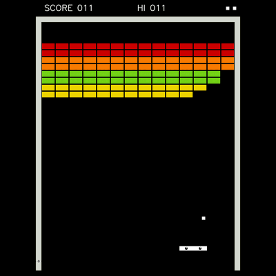
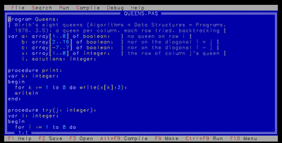
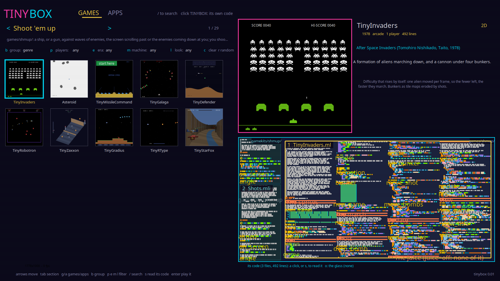
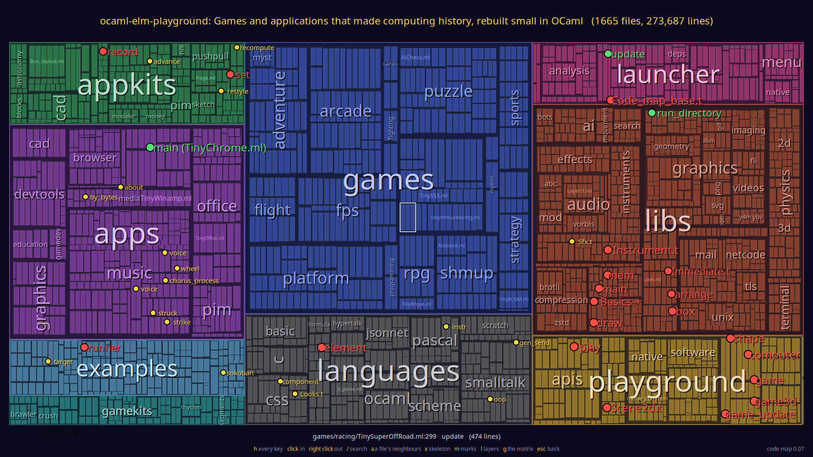
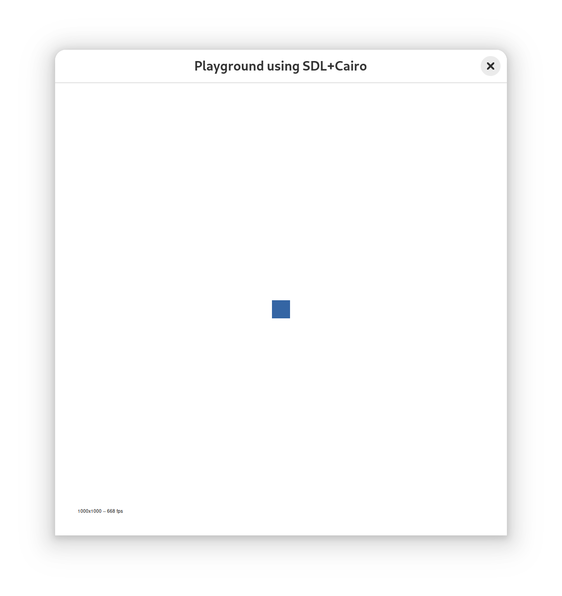

OCaml Elm Playground
=======================

Create pictures, animations, and video games (and even applications)
with OCaml, in 2D and 3D!

It started as a port to OCaml of the excellent Elm playground package
https://github.com/evancz/elm-playground, and it keeps its spirit:

> This is the package I wanted when I was learning programming. Start by
> putting shapes on screen and work up to making games. I hope this
> package will be fun for a broad range of ages and backgrounds!
> *- Evan Czaplicki*

Evan's package is a library and a handful of examples. This repository
goes further: besides the library, it holds **145 games and 53
applications** written with it. It is an ode to code: a collection of
the programs that made computing history, from Pong, Breakout and
Pac-Man to Doom and Quake, from VisiCalc and MacPaint to Turbo Pascal
and Smalltalk-80. Each one is rebuilt in miniature but working, and
comes with its story: who made the original, when, and what it brought
that was new. And each is small, a few hundred lines to a few
thousand, so that you can read the whole of it and appreciate it as a
piece of art, not only use it; it runs natively on your desktop and in
your browser, from the same source file:

| [TinyBreakout](games/arcade/TinyBreakout.ml) ([play it](https://aryx.github.io/ocaml-elm-playground/games/arcade/TinyBreakout.html)) | [TinyTurboPascal](apps/devtools/TinyTurboPascal.ml) ([run it](https://aryx.github.io/ocaml-elm-playground/apps/devtools/TinyTurboPascal.html)) |
| :---: | :---: |
| <a href="https://aryx.github.io/ocaml-elm-playground/games/arcade/TinyBreakout.html"></a> | <a href="https://aryx.github.io/ocaml-elm-playground/apps/devtools/TinyTurboPascal.html"></a> |
| Breakout (Atari, 1976): the wall, the paddle, the ball -- **525 lines**, [in one file](https://aryx.github.io/ocaml-elm-playground/codemap.html?code=TinyBreakout&street) | Turbo Pascal 7 (Borland, 1992): the editor, the compiler and the debugger -- **3,213 lines** [in 15 files](https://aryx.github.io/ocaml-elm-playground/codemap.html?code=TinyTurboPascal&street): the IDE, and the Pascal compiler and P-machine under it[^fkeys] |

[^fkeys]: Turbo Pascal lives on its function keys (F9 compiles, F10
    opens the menus). If yours are taken -- a laptop's top row set to
    volume and brightness, a Mac, a browser keeping them -- press **Esc,
    then a digit**: Esc 9 is F9, Esc 0 is F10. Alt and the digit work
    too, except on a Mac, and Ctrl and the digit is Ctrl and the F key
    (Ctrl 9 runs).

They are all in [CATALOG.md](CATALOG.md), and all in one menu,
[tinybox](https://aryx.github.io/ocaml-elm-playground/tinybox.html)
(and [by size](https://aryx.github.io/ocaml-elm-playground/by-size/),
the smallest first). The whole repository can be explored in the
browser in its [code map](https://aryx.github.io/ocaml-elm-playground/codemap.html);
the links saying how many lines a program is open it on that
program's own code (`w` widens it to what it uses, then to everything).

<a href="https://aryx.github.io/ocaml-elm-playground/tinybox.html"></a>

tinybox's menu: the programs of a section, the chosen one previewed
live, and its code as a map (a click on the picture opens the menu in
your browser).

<a href="https://aryx.github.io/ocaml-elm-playground/codemap.html"></a>

The code map: the whole repository, each folder a region, each file a
block the size of its code -- zoom in and the blocks are the code
itself (a click on the picture opens it in your browser).

The main goal of all this is to teach people. Almost all of the code,
the library as much as the programs, was written by an AI, Claude
Code, under the author's direction (see the
[AI disclaimer](#ai-disclaimer)), but it was written for people to
read, and checked by tests: judge each module by what it explains, as
you would a textbook's.

A place to learn, by reading
----------------------------

Evan's playground is for learning to *write* programs. This repository
is also for learning by *reading* them. Everything a game or an
application needs is written here from scratch, in plain OCaml: the
pixels, the sound, the physics, the AI, the widgets. There is no game
engine, no GPU requirement, and no C library doing the interesting part.
Each module holds one idea, and its `.mli` explains that idea, often
with an ASCII diagram, the paper or machine it comes from, and a worked
example checked by a test. So when you wonder how a triangle becomes
pixels, how a PNG is decompressed, how a Moog filter gets its sound, or
how a chess program picks its move, the answer is a few hundred lines
you can open and read.

The software that usually does this work is not like that. A graphics
stack, a game engine, a codec library or a web browser is millions of
lines, and nobody understands the whole of it. Here each subject is
small enough for one person to read whole. That an AI wrote most of it
is the paradox, the same as in [IX](https://aryx.github.io/IX/#goal):
the trend these days is to use AI to write more and more code, until
only the AI can change the program, and here it rewrites giant
programs in far **less** code, so that humans can understand them
again, and extend them. Ultimately these
libraries may become
[literate programs](https://principia-softwarica.org/literate-programming.html),
as in [Principia Softwarica](https://principia-softwarica.org/): books
that tell the code as a story, in the order a reader needs, to teach
even better.

**AI makes the programs smaller. Humans understand more.**

The library (`libs/` and `playground/`) is **about 73,000 lines of
OCaml**, `.mli` files and their explanations included; with the kits
and the languages the programs share, about 119,000. That leaves out
the tests, the games and the applications (an area's name leads to its
modules in the API documentation, each with its explanation):

| area | lines | what you can read there |
| ---- | ----: | ----------------------- |
| [**the playground**](https://aryx.github.io/ocaml-elm-playground/elm_playground/index.html#playground) (`playground/`, `libs/core/`, `libs/random/`) | 22,100 | the 2D and 3D APIs and their seven backends (Cairo/SDL, vdom/SVG, OpenGL, WebGL, software), cameras, sprites, tilemaps, 3D characters, ragdolls and portals, and other ways to program: Logo's turtle, HtDP's big-bang and universe, PuzzleScript, Karel, POV-Ray, the teletype and text mode |
| [**graphics**](https://aryx.github.io/ocaml-elm-playground/elm_playground/index.html#graphics) (`libs/graphics/`) | 13,700 | a 2D rasterizer (lines, circles, polygon fill, strokes), a 3D one (projection, clipping, culling, z-buffer and painter's algorithm, flat/Gouraud/Phong shading, texture mapping), a ray tracer (CSG, bounding volumes), Hershey and VGA fonts, image processing (histograms, convolutions, Sobel, blending); image formats: PNG with its own inflate, Huffman and CRC, GIF (LZW), baseline JPEG (DCT) read and written, XPM, the Amiga's ILBM; and video: Y4M, FLI/FLC, AVI with Motion JPEG, MPEG-1 decoded and encoded |
| [**physics**](https://aryx.github.io/ocaml-elm-playground/elm_playground/index.html#physics) (`libs/physics/`) | 5,300 | 2D and 3D rigid bodies: integrators, broadphase, collision detection, contact resolution, an iterative solver, joints, springs, quaternions, continuous collision, particles, and gravity (Kepler's orbits) |
| [**audio**](https://aryx.github.io/ocaml-elm-playground/elm_playground/index.html#audio) (`libs/audio/`) | 11,200 | oscillators, noise, envelopes, LFOs, filters (state-variable, Moog and diode ladders), FM synthesis with the DX7's algorithms, Karplus-Strong strings, modal synthesis, a sampler, a step sequencer, a Fourier spectrum, stereo space, a rack of effects (drive, EQ, chorus, phaser, delay, reverb, compressor, a Leslie), a mixer, sound effects and music, and WAV, MIDI, ABC and MOD files, and MP2 and MP3 decoded |
| [**AI**](https://aryx.github.io/ocaml-elm-playground/elm_playground/index.html#ai) (`libs/ai/`) | 3,600 | pathfinding, state machines, behavior trees, utility AI, steering and flocking, minimax with iterative deepening and Zobrist hashing, Monte Carlo tree search, Q-learning, and neural networks trained by backpropagation and by our own automatic differentiation |
| [**GUI**](https://aryx.github.io/ocaml-elm-playground/elm_playground/index.html#gui) (`libs/gui/`, `libs/juice/`) | 4,200 | a toolkit: widgets, layout, focus, text editing, grids and themes, wired four ways (callbacks, MVC, MVU, immediate mode); and game juice: easing, tweens, screen shake, squash and stretch, particles |
| [**networking**](https://aryx.github.io/ocaml-elm-playground/elm_playground/index.html#networking) (`libs/networking/`, `libs/crypto/`, `libs/compression/`) | 11,000 | the protocols as bytes in, bytes out: URLs, HTTP/1.1, WebSocket, IRC, mail (SMTP, POP3, MIME); netcode (lockstep, rollback, prediction and interpolation); TLS 1.3 with X.509 certificates, over SHA-2, HMAC, HKDF, ChaCha20-Poly1305, AES-GCM, X25519, ECDSA and RSA; Huffman codes, inflate and deflate, LZW |
| [**the terminal**](https://aryx.github.io/ocaml-elm-playground/elm_playground/index.html#terminal) (`libs/terminal/`) | 1,500 | a VT100's screen, the tty's line discipline, programs that ask and wait as values, curses, full-screen text programs |
| [**application engines**](https://aryx.github.io/ocaml-elm-playground/elm_playground/index.html#appkits) (`appkits/`) | 19,700 | a spreadsheet (dependency graph, recalculation), rich text poured into pages with Knuth-Plass line breaking, bitmap painting (seed fill, PackBits), structured drawing, compound documents, slides, undo and the clipboard; a web browser's engine (box, flex and table layout, the DOM for scripts); vi and Emacs, and Turbo Pascal's IDE and debugger; Scratch's blocks; CAD (Sketchpad's constraints, AutoCAD's commands and DXF, SketchUp's push/pull); a 3D modeler; a planetarium's astronomy; calendars and address books |
| [**game kits**](https://aryx.github.io/ocaml-elm-playground/elm_playground/index.html#gamekits) (`gamekits/`) | 6,200 | how each genre works: Doom's sectors, heightmap terrains, Descent's mines, isometric projection, racing roads and 3D tracks, platformer slopes and ladders, maze chases, hitboxes and frame data for fighting games, animated skeletons, RTS orders, team formations, rhythm charts, a Sokoban solver, playing cards, ... |
| [**languages**](https://aryx.github.io/ocaml-elm-playground/elm_playground/index.html#languages) (`languages/`) | 19,800 | languages as text, parsed and run: a spreadsheet's formulas, BASIC, Emacs Lisp, Pascal compiled to P-code, HyperTalk, Smalltalk-80 and its bytecode interpreter, Scratch and Snap!, JavaScript, HTML and CSS |

With the library doing the heavy lifting, a program built on it stays
short enough to read in one sitting. It is not a toy sketch either, but
a working version of a famous original:

- [TinyMario](games/platform/TinyMario.ml) ([play it](https://aryx.github.io/ocaml-elm-playground/games/platform/TinyMario.html)):
  **[419 lines in 3 files](https://aryx.github.io/ocaml-elm-playground/codemap.html?code=TinyMario&all)**;
- [TinyStreetFighter](games/fighting/TinyStreetFighter.ml) ([play it](https://aryx.github.io/ocaml-elm-playground/games/fighting/TinyStreetFighter.html)):
  [738 lines in 7 files](https://aryx.github.io/ocaml-elm-playground/codemap.html?code=TinyStreetFighter&all);
- [TinyZelda](games/adventure/TinyZelda.ml) ([play it](https://aryx.github.io/ocaml-elm-playground/games/adventure/TinyZelda.html)):
  [535 lines in 5 files](https://aryx.github.io/ocaml-elm-playground/codemap.html?code=TinyZelda&all);
- [TinyDoom](games/fps/TinyDoom.ml) ([play it](https://aryx.github.io/ocaml-elm-playground/games/fps/TinyDoom.html)):
  [806 lines in 3 files](https://aryx.github.io/ocaml-elm-playground/codemap.html?code=TinyDoom&all), and its 3D twin
  [TinyDoom3d](games/fps/TinyDoom3d.ml) ([play it](https://aryx.github.io/ocaml-elm-playground/games/fps/TinyDoom3d.html)),
  over the same level: [484 lines in 3 files](https://aryx.github.io/ocaml-elm-playground/codemap.html?code=TinyDoom3d&all);
- [TinyQuake](games/fps/TinyQuake.ml) ([play it](https://aryx.github.io/ocaml-elm-playground/games/fps/TinyQuake.html)),
  whose level is compiled by its own qbsp, vis and light at startup:
  [623 lines, in one file](https://aryx.github.io/ocaml-elm-playground/codemap.html?code=TinyQuake);
- [TinySimCity](games/strategy/TinySimCity.ml) ([play it](https://aryx.github.io/ocaml-elm-playground/games/strategy/TinySimCity.html)):
  [528 lines, in one file](https://aryx.github.io/ocaml-elm-playground/codemap.html?code=TinySimCity);
- [TinyExcel](apps/office/TinyExcel.ml) ([run it](https://aryx.github.io/ocaml-elm-playground/apps/office/TinyExcel.html)),
  a spreadsheet with a menu bar, a formula bar and range selection:
  **[1,587 lines in 11 files](https://aryx.github.io/ocaml-elm-playground/codemap.html?code=TinyExcel&all)**, most of them
  the engine it shares with [TinyVisiCalc](apps/office/TinyVisiCalc.ml) ([run it](https://aryx.github.io/ocaml-elm-playground/apps/office/TinyVisiCalc.html),
  [1,192 lines in 7 files](https://aryx.github.io/ocaml-elm-playground/codemap.html?code=TinyVisiCalc&all)),
  and the header explains what changed between 1979 and 1985;
- [TinyWord](apps/office/TinyWord.ml) ([run it](https://aryx.github.io/ocaml-elm-playground/apps/office/TinyWord.html)),
  a word processor: [1,771 lines in 17 files](https://aryx.github.io/ocaml-elm-playground/codemap.html?code=TinyWord&all);
- [TinyMacPaint](apps/graphics/TinyMacPaint.ml) ([run it](https://aryx.github.io/ocaml-elm-playground/apps/graphics/TinyMacPaint.html)),
  with its patterns and flood fill:
  [1,526 lines in 17 files](https://aryx.github.io/ocaml-elm-playground/codemap.html?code=TinyMacPaint&all);
- [TinyMinimoog](apps/music/TinyMinimoog.ml) ([run it](https://aryx.github.io/ocaml-elm-playground/apps/music/TinyMinimoog.html)),
  the Model D synthesizer with its panel of knobs:
  [1,367 lines in 5 files](https://aryx.github.io/ocaml-elm-playground/codemap.html?code=TinyMinimoog&all).

**A budget.** No program may be longer than **5,000 lines of its own
code**. That counts its file and every module of its folder, of the
kits (`gamekits/`, `appkits/`) and of the languages (`languages/`)
that it uses, found by following the modules it names; tinybox's code
map shows it, and `make test` checks it (`tests/catalog/`, counted by
`launcher/codemap/deps/Code_deps`). It leaves out the library (`libs/`,
`playground/`), and this is not cheating: the library is truly general,
the pixels, sounds, physics and codecs any program could use, while an
appkit, a gamekit or a language is made for a few particular programs,
a spreadsheet's recalculation, a genre's rules, Emacs's Lisp, so it is
theirs and counts. Six programs are over it, each for a whole language
it carries, and listed as exceptions in the test (which says when one
comes back under): [TinySmalltalk80](apps/devtools/TinySmalltalk80.ml)
(Smalltalk-80), [TinyChrome](apps/internet/TinyChrome.ml),
[TinyFirefox](apps/internet/TinyFirefox.ml) and
[TinyNetscape](apps/internet/TinyNetscape.ml) (JavaScript and the
browser's engine), [TinyMosaic](apps/internet/TinyMosaic.ml) (the
browser's engine: HTML, CSS and the layout), and
[TinyOffice](apps/office/TinyOffice.ml) (the spreadsheet's formulas
and HyperTalk).

The biggest, [TinyChrome](apps/internet/TinyChrome.ml), is **14,991
lines**, [in 89 files](https://aryx.github.io/ocaml-elm-playground/codemap.html?code=TinyChrome&all).
Yes, you read that right: 15,000 lines of OCaml for a web browser that
parses HTML and CSS, cascades the styles, lays out blocks, floats,
tables and flexbox, draws SVG, plays `<video>`, carries its own
JavaScript engine and Chrome's developer tools -- enough to read
Hacker News with it, over the repository's own TLS 1.3:

    tinybox chrome url=https://news.ycombinator.com

It runs [in your browser](https://aryx.github.io/ocaml-elm-playground/apps/internet/TinyChrome.html)
too, but there a page may only read the sites that allow it (CORS), and
Hacker News does not: on the web it shows its own built-in pages.

There are 145 games and 53 applications like these, listed in
[CATALOG.md](CATALOG.md). Each one starts with a header about its
original and what it borrows from the library, and the games that fake
3D point out the trick they use. The
tutorials in [docs/claude_notes/tutorials/](docs/claude_notes/tutorials/)
(3D, 2D, physics, audio, synthesizers, AI, images, fonts, GUI, ...) walk
through each subject module by module.


Documentation
---------------------------------------------------

* [Getting started](https://github.com/aryx/ocaml-elm-playground?tab=readme-ov-file#ocaml-elm-playground) (this file)
* [Tutorial](https://aryx.github.io/ocaml-elm-playground/elm_playground/)
* [Basic examples](https://aryx.github.io/ocaml-elm-playground/examples/)
* [Basic games](https://aryx.github.io/ocaml-elm-playground/games/)
* [API reference](https://aryx.github.io/ocaml-elm-playground/elm_playground/Playground/)
* [Catalogue of the games and applications](CATALOG.md)
* [3D, from scratch: a tutorial](docs/claude_notes/tutorials/notes_3d.md),
  and the [other tutorials](docs/claude_notes/tutorials/) (2D, physics,
  audio, AI, images, GUI, ...)
* [Index](https://aryx.github.io/ocaml-elm-playground)
* [Changelog](changes.txt)

Features
--------------

The OCaml `elm_playground` package allows you to easily create
*pictures*, *animations*, and even *video games* in a portable way using an API that
really simplifies how to view the computer and its devices (the screen,
keyboard, and mouse).

The goal is similar to the old [`graphics` package](https://github.com/ocaml/graphics)
but goes even further in terms of simplification.

The main API is defined in a single
[Playground.mli](https://github.com/aryx/ocaml-elm-playground/blob/master/playground/Playground.mli) module and is implemented by two backends:
 - a *native* (SDL-based) backend to run your game on your desktop from a terminal
 - a *web* (vdom-based) backend to run your game in a browser

Here is for example a simple [Snake game](https://aryx.github.io/ocaml-elm-playground/games/arcade/Snake.html) you can run from your browser (use the arrow keys to change the direction of the snake and eat the ball to grow your length). You can run the same game
on your desktop *without changing a line of code*.

The same idea one dimension up is `Playground3d`
([Playground3d.mli](https://github.com/aryx/ocaml-elm-playground/blob/master/playground/Playground3d.mli)):
shapes in space, a camera, and the same `game` loop. Its main backend
wraps no OpenGL, Vulkan or WebGL -- the projection, the camera math and
the whole triangle rasterizer are hand-written OCaml, on purpose, so
that you can read every line that turns a 3D shape into pixels (two
other backends then hand the same scenes to a real GPU, for comparison
and for speed). See [In 3D](#in-3d) below.

Credit where due: `Playground3d`'s API (world-space shapes, an
eye/target camera, and the trick of compiling a 3D scene down to plain
2D shapes for the browser) is adapted from Luca Mugnaini's
[elm-playground-3d](https://github.com/lucamug/elm-playground-3d),
itself built on Evan Czaplicki's original
[elm-playground](https://github.com/evancz/elm-playground); the
`StarCollector3d.ml` example's mechanics are adapted from Nate Abele's
[elm-3d-playground](https://github.com/nateabele/elm-3d-playground).
The fuller survey -- VRML, OpenGL, WebGL, Vulkan, Unity -- is in
[notes_playground3d_related_work.md](docs/claude_notes/related-work/notes_playground3d_related_work.md).

Install
--------------

To install the playground, run `opam install elm_playground` and then
install one or both backends with `opam install elm_playground_native`
and/or `opam install elm_playground_web`. The 3D packages
(`elm_playground_3d` and its backends `elm_playground_3d_opengl`,
`elm_playground_3d_software`, `elm_playground_3d_webgl`,
`elm_playground_3d_web`) live in this repository and are released the
same way.

To play the games and use the applications rather than write your own,
install `tinybox` with `opam install tinybox`: after BusyBox, every one
of them linked into one binary (2D on Cairo, 3D on OpenGL). `tinybox`
alone opens a menu to choose one, with its screenshot and its code map,
`tinybox list` names them all, and `tinybox TinyMario` runs one
directly, with the same flags as its own executable. From a clone of
this repository, `make` builds it as `./bin/tinybox`; the same menu
runs [in your browser](https://aryx.github.io/ocaml-elm-playground/tinybox.html).

Simple native application
--------------------------

Here is a very simple application using the playground:
```ocaml
open Playground

(* the (x, y) position of the blue square  *)
type model = (float * float)

let initial_state : model = (0., 0.)

let view _computer (x, y) = [ 
  square blue 40.
   |> move x y
 ]

let update computer (x, y) =
  (x +. to_x computer.keyboard, y +. to_y computer.keyboard)

let app = 
  game view update initial_state

let main = Playground_platform.run_app app
```
<!-- coupling: docs/toy-native-example/toy.ml and examples/Keyboard.ml -->

It is a very simple `game` defining a `model` type, a `view` function, and an `update` function to specify how the game behaves. It is using the
"Model-View-Update" architecture to organize the code of a graphical
interactive application
(see https://guide.elm-lang.org/architecture/ for more information).

To compile this application, simply do:
```bash
$ cd docs/toy-native-example
$ opam install --deps-only --yes .
$ dune exec --root . ./Toy.exe
```
You should then see on your desktop:



If you type on the arrow keys on your keyboard the blue square should move in the
corresponding direction. If you type `q` it will exit the game.

Note that with the Playground API the center of the screen is at `(0, 0)`.

Simple web application
--------------------------

To compile this same application for the web, simply do:

```bash
$ cd docs/toy-web-example
$ opam install --deps-only --yes .
$ dune build --root .
$ cp _build/default/Toy.bc.js static/
```
You should then be able to use the web app by going to:
https://aryx.github.io/ocaml-elm-playground/toy-web-example/static/Toy.html

By default the generated javascript file can be big so to get a smaller one
you can do instead:
```bash
$ dune build --root . --profile=release
$ cp _build/default/Toy.bc.js static/
```

Parameters (flags)
------------------

A program can be given parameters, the same way natively and on the
web: `name=value` (or just `name`) arguments on the command line, or
the URL's `?name=value&name`:

```bash
$ dune exec examples/Flags.exe -- color=red speed=3
```
or `Flags.html?color=red&speed=3` in a browser.

Like Elm's flags, they reach the application purely: `main` reads them
with `Playground_platform.flags ()` and gives them to `run_app`, and
every `view` and `update` then finds them in `computer.flags`, as
`(name, value)` pairs:

```ocaml
let update computer (x, y) =
  let speed =
    match List.assoc_opt "speed" computer.flags with
    | Some s -> float_of_string s
    | None -> 1.
  in
  (x +. speed *. to_x computer.keyboard, y +. speed *. to_y computer.keyboard)

let main = Playground_platform.run_app ~flags:(Playground_platform.flags ()) app
```

(see [examples/Flags.ml](examples/Flags.ml); a program that doesn't pass
`~flags` gets none). The arguments starting with a dash (`-debug`,
`-fixed-time 1000`, ...) are the playground's own. The same works for
3D programs, with `Playground3d_platform.run_app3d ~flags`.

In 3D
-----

The same three functions, with shapes in space and a camera:

```ocaml
open Playground
open Playground3d

let view (computer : Playground.computer) () =
  let angle = spin 6. computer.time in
  let scene = cube purple 1.5 |> rotate3d 0. angle 0. in
  let cam = camera ~eye:(3., 2., 5.) ~target:(0., 0., 0.) () in
  (cam, [ scene ])

let update _computer () = ()

let app = game3d view update ()
let main = Playground3d_platform.run_app3d app
```

`view` returns a camera and the shapes it looks at. The camera keeps
(0, 1, 0) as up unless told otherwise; a game whose ship rolls or looks
straight up gives its own (`camera ~eye ~target ~up ()`, see
`TinyDescent3d.ml`). `cube`/`box`/`plane` are procedurally generated,
single-flat-color shapes -- no assets needed, the same philosophy as
2D's `circle`/`square` -- and `textured_cube`/`textured_quad` take a
file path or an http(s) URL and sample the image for real, per pixel. A
texture can also travel inside the program, with no file to find at run
time: a dune rule turns the image into base64
(`scripts/build/file_to_base64_ml.ml`), and
`Playground3d.embedded_texture ~name ~base64` gives it a name to use as
a `src` (see `TinyMinecraft.ml` and its dune file).

Some to run, from this repository:

```bash
dune exec examples/Cubes3d.exe         # a grid of overlapping cubes, orbited by the camera
dune exec examples/TexturedCube3d.exe  # a cube wrapped with a test texture
dune exec examples/software/Corridor3d.exe  # walk down a corridor (up/down arrows)
dune exec examples/StarCollector3d.exe # move a box, collect randomly-spawning stars
dune exec games/flight/TinyDescent3d.exe    # fly a ship through a mine (arrows, a/d, w/s)
dune exec games/fps/TinyQuake.exe      # a Quake level: qbsp, vis and light at startup
```

In a browser: `make serve-build`, then e.g.
http://localhost:8001/examples/web/TexturedCube3d.html (the pages must
be served over HTTP, not opened as files, for the WebGL textures to
load; the Makefile's comment above `serve-build` says why).

An application chooses how it is drawn, portably, with
`Playground3d.rendering`:

```ocaml
let main =
  Playground3d_platform.run_app3d
    ~rendering:{ default_rendering with shading = Flat } app
```

- `shading`: `No_lighting`, `Flat` (crisp facets), or `Smooth` (curved
  shapes look round; the default);
- `backface_culling`: `false` to also draw the faces turned away from
  the camera, e.g. for a lone `plane` seen from below;
- `smooth_textures`: `false` for sharp texels (pixel-art textures).

Each backend does what it can (see below). The 2D playground has the
same idea, `Playground.rendering`.

Backends
--------

The same application code runs on several backends, which is the point
of the two `.mli` files above: a program names `Playground_platform`
(or `Playground3d_platform`) and the dune file chooses who implements
it.

|                  | 2D                                  | 3D                                   |
| ---------------- | ----------------------------------- | ------------------------------------ |
| native, a library | **native**: Cairo, SDL for the window | **opengl**: OpenGL 3.3 and two small shaders |
| native, from scratch | **software**: our own 2D rasterizer  | **software**: our own 3D rasterizer   |
| browser          | **web**: vdom, SVG                  | **webgl**: WebGL 1, with the 2D backend's SVG for the HUD |
|                  |                                     | **svg**: the scene compiled to 2D shapes, drawn by the web backend |

The `software` backends compute every pixel themselves, from
`graphics/` -- projection, clipping, culling, a z-buffer, shading,
texture mapping, one module per idea, each `.mli` explaining its
algorithm with a diagram and a worked example. They use SDL only for
the window, the input and showing the finished image. That is where the
rasterizers of this repository live, and `make test` compares their
output with golden frames, pixel by pixel.

The `svg` 3D backend is the cheapest of the four: it turns a 3D scene
into ordinary 2D `Playground.shape` values every frame (backface-culled
and depth-sorted) and hands them to the unmodified web backend, getting
SVG rendering, the event loop and browser timing for free -- at the
cost of some fidelity (see the limitations below).

Debug keys
----------

Natively, the platform's keys are all Ctrl and a key, so that a plain
key is always the program's (a game's `h`, a `q` typed in a field):
Ctrl+Q quits, and the debug keys below are Ctrl and their letter. An
application that wants every key, Ctrl's included, says
`run_app ~window:{ Playground.default_window with platform_keys = false }`.

A program run with `-debug-keys` (e.g. `dune exec examples/Cubes3d.exe
-- -debug-keys`) turns a dozen keys, with Ctrl, into live toggles of how
it is drawn: `m` cycles the shading (no lighting, flat, Gouraud, Phong), `f`
draws the wireframe, `z` swaps the z-buffer for the painter's
algorithm, `c` turns near-plane clipping off, `x` is a pixel
magnifier, `r` drops the resolution, `o` runs the unoptimized code, and
`h` shows the lot with their current state. Each one is there to make
one idea visible: what every key demonstrates, and why, is section 11
of [notes_3d.md](docs/claude_notes/tutorials/notes_3d.md). Without the
flag they are off, so a game can use any key it likes. The WebGL pages
take the same toggles as URL parameters (`?debug-keys`, `?keys=mb`,
`?fixed-time=1000`), since a page has no command line.

Two more flags make a run reproducible, which is how the golden frames
are made: `-fixed-time t` freezes the clock, and `-script
"right:1-60,space:30"` plays the keys and the mouse frame by frame (see
`Input_script.mli`).

Current limitations of the 3D playground
----------------------------------------

- One fixed directional light (flat, Gouraud, or Phong shading) -- no
  shadows, no multiple or colored lights, no specular highlights.
- One curved primitive, `sphere` (no `cylinder`/`cone` yet) --
  everything else is built from flat polygons.
- The SVG backend can't warp a texture onto an arbitrary projected
  quad, so a textured face renders as a flat gray placeholder there
  (the other backends sample the real texture per pixel).
- No near-plane clipping on the SVG backend either (a triangle with a
  vertex behind the camera is dropped whole, not clipped into visible
  sub-triangles; the software backend clips, see the `c` key, and the
  GPU ones in hardware).
- No transparency on the software and GPU backends (`fade3d` is
  ignored there): blending needs the faces drawn back to front, which
  the z-buffer doesn't give.
- The WebGL backend's textures need the page served over HTTP, and its
  wireframe (lines, WebGL having no polygon mode) is never culled.

Next steps
------------

Read the tutorial at:
https://aryx.github.io/ocaml-elm-playground/elm_playground/

Look at the code under [examples/](examples/) and [games/](games/), a
directory per genre; every game and application is listed, with the
original it is a toy version of, in [CATALOG.md](CATALOG.md).

To see them all running, open the
[web tinybox](https://aryx.github.io/ocaml-elm-playground/tinybox.html),
or the galleries of the
[games](https://aryx.github.io/ocaml-elm-playground/games/) and the
[applications](https://aryx.github.io/ocaml-elm-playground/apps/), each
with its screenshot, played in your browser with a click.

What the project has become
---------------------------

The playground is still the small library above, but around it this
repository has grown into a place to learn how the things it draws are
made (see [A place to learn, by reading](#a-place-to-learn-by-reading)
for the numbers), each subject written from scratch, one idea per
module, with the idea explained in its `.mli` and checked by tests and
golden frames:

- **pictures**: `libs/graphics/`, the 2D and 3D software rasterizers behind
  the `software` backends, and `Playground3d` for 3D programs;
- **games**: `games/`, a directory per genre (see
  [CATALOG.md](CATALOG.md)), 2D, 2.5D (each pseudo-3D trick written out
  in its game) and 3D side by side, over the genre kits of `gamekits/`;
- **motion, sound, decisions, networks**: `libs/physics/`,
  `libs/audio/`, `libs/ai/`, `libs/networking/`;
- **applications**: `libs/gui/`, a small toolkit with the same widgets
  wired four ways (callbacks, MVC, MVU, immediate mode), the engines of
  `appkits/`, and the Tiny applications of `apps/` -- TinyVisiCalc and
  TinyExcel over one spreadsheet engine, TinyBravo and TinyWord over
  one text engine, TinyFrameMaker (the text poured over pages),
  TinyMacPaint and TinyMacDraw (dots, and objects),
  TinyOpenDoc (a document made of
  parts), TinyPowerPoint and TinyHyperCard -- and TinyOffice, the suite
  as it is today, where every kind of document holds the others.

The plans and tutorial notes for each are in
[docs/claude_notes/](docs/claude_notes/); for the applications, start
with [notes_gui.md](docs/claude_notes/tutorials/notes_gui.md).

Trademarks and originals
------------------------

The games and applications here are small studies of famous programs,
written from scratch to show how much of an original's design fits in
a few hundred lines of OCaml. They are for learning, not a substitute
for the originals, which we encourage you to play and buy. No code,
graphics, music, levels or text were taken from the originals: the
pixel art, tunes and levels are our own, in the originals' spirit, and
only the ideas and mechanics (which copyright does not cover) are
reproduced.

The names of the originals (Super Mario Bros., Zelda, Tetris,
Photoshop, Chrome, ...) are trademarks of their owners, used here only
to say which program each study is after. This project is not
affiliated with, endorsed by, or sponsored by any of them. It is free,
non-commercial, and makes no money. If you hold rights to one of these
works and object to anything here, please open an issue and it will be
changed or removed.

AI disclaimer
------------

The 2D playground API (`Playground.mli`) and the ideas behind it are the
work of Evan Czaplicki for Elm at https://github.com/evancz/elm-playground
I (Pad) mostly ported the API and ideas, as well as some of the web backend code,
to OCaml. I then added also a native backend (using tsdl), which was not
in the Elm version (Elm is a web language).
The other APIs, written in the same spirit as Evan's (a few records and
functions, called from the same `view` and `update`), are Claude Code's: `Physics`,
`Audio`, `Ai`, `Gui`, `Sprite`, `Tilemap`, `Logo`, and the rest of
`playground/`. The exception is `Playground3d`, which is adapted from
Luca Mugnaini's elm-playground-3d (see the credits above).
The playground itself is still very small: the 2D API with its Cairo
and vdom backends is about 5,000 lines, and the 3D one about 1,000 over
a 1,200-line rasterizer.

I recently (Sep 2026) used Claude Code to fix many small bugs, and then
to grow everything around that library: the repository is now about
280,000 lines of OCaml, tests included, and almost all of it was
written by Claude Code -- I chose what to build, directed it and
reviewed it, but I wrote very little of the code myself. And yet it
stays small for what it holds -- 145 games and 53 applications, the
2D and 3D rasterizers, a ray tracer, a physics engine, synthesizers,
game AI, a GUI toolkit, a TLS 1.3 stack, a web browser's engine and a
dozen languages, all written from scratch, with no engine, no asset
pipeline and no dependency doing the work underneath.
